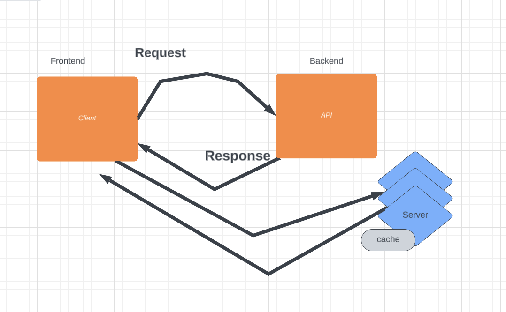

# city-explorer-api
# Lab 07 & Lab 08

**Author**: Ashley Taylor
**Version**: 1.0.0 (increment the patch/fix version number if you make more commits past your first submission)

## Overview

- This project uses an API to add weather information to my city explorer site.

- Trello: https://trello.com/b/xhB1Yfv3/week-2

## Getting Started

- Create Repo
- Connect API
- Get data from .json
- 
- https://trello.com/b/fYZHhQDa/lab-5

## Architecture

Get data from .json storage and place within JS components that dispaly via react bootstrap cards.

Lab 08 - Replacing .json date with live data from weatherbit api

## Change Log

- 05-19-2023 10:34am - Project repository in place.

## Credit and Collaborations

Sheyna Watkins Class 301 Day 07, 08 Class Recording; Jared Ciccarello; Arthur Francisco;

Name of feature: Lab 07

Estimate of time needed to complete: 
6 hrs

Start time: 12am/10:30am/5pm/9pm/1:30pm/5:30pm

Finish time: 1am/11:30am/8pm/3:30am/2:30pm/7:30pm

Actual time to complete: 14 hrs

Name of feature: Lab 08

Estimate of time needed to complete: 
3 hrs

Start time: 6:30 pm/

Finish time: 

Actual time to complete: 
